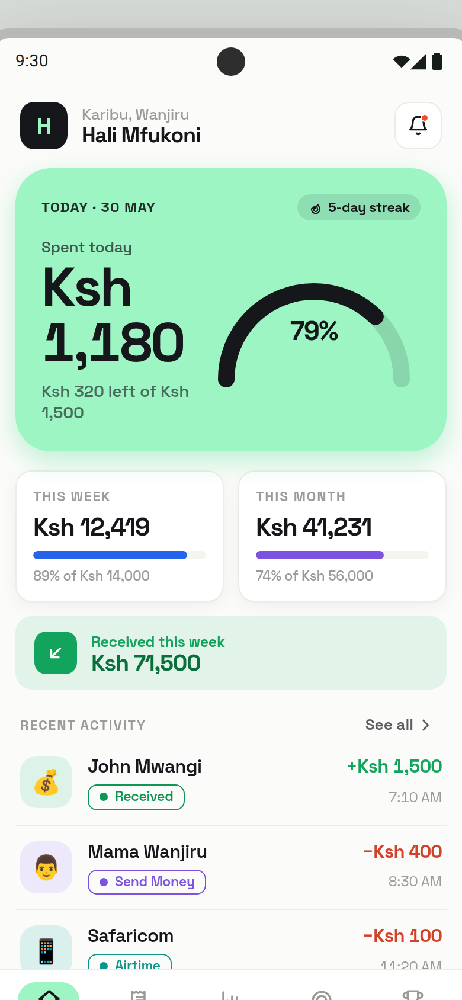
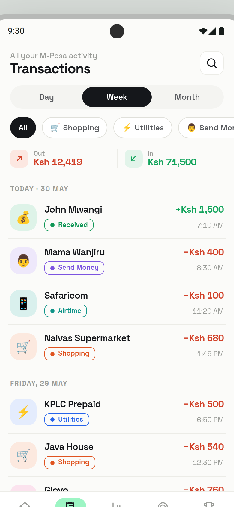
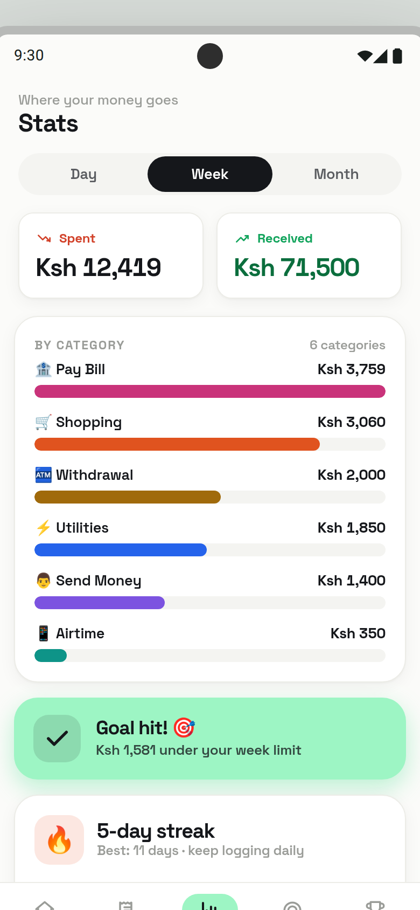
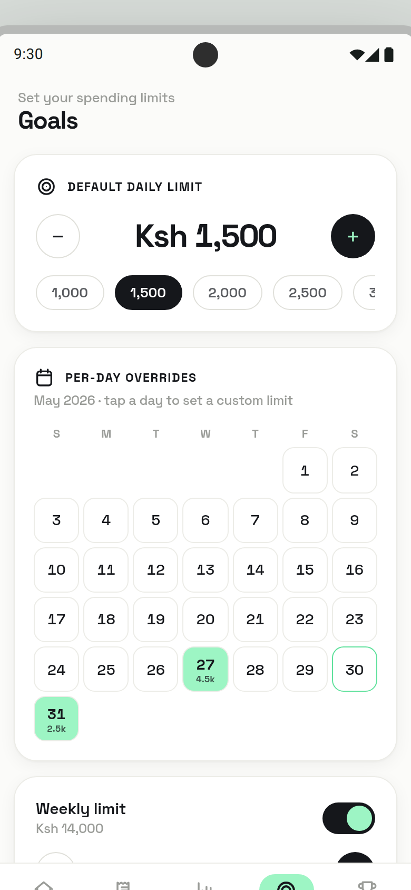
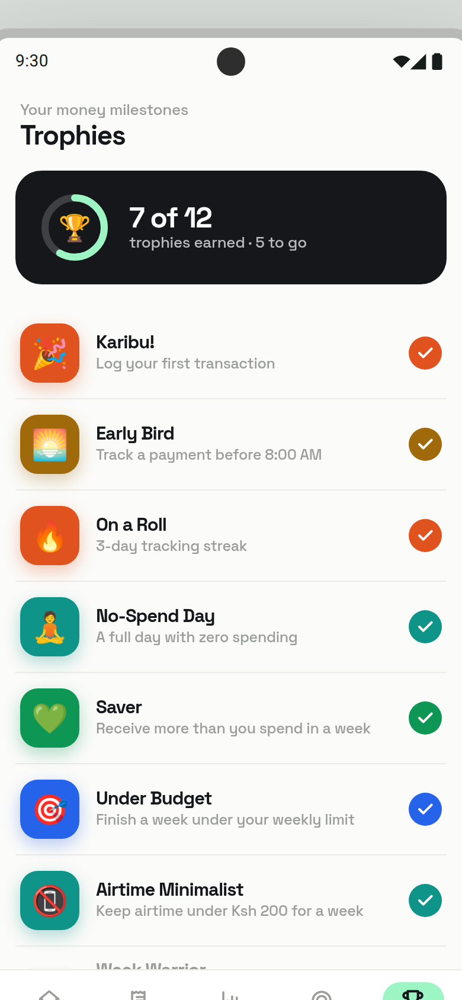

# Hali Mfukoni 💚

**The open-source M-Pesa budget planner for Android.**

Hali Mfukoni ("wallet status" in Swahili) automatically reads your M-Pesa SMS messages and turns them into a clear picture of your finances — how much you've spent, received, and owe on Fuliza. No accounts. No subscriptions. No internet required.

---

## What it does

- **Automatic transaction tracking** — scans your M-Pesa SMS inbox and parses every transaction: send money, receive money, withdraw, buy goods (till), pay bill, airtime, and Fuliza overdraft
- **Balance at a glance** — always shows your current M-Pesa balance. If your balance is zero and you owe Fuliza, the outstanding amount appears in red right alongside it
- **Daily, weekly & monthly budgets** — set spending limits and track progress against them in real time
- **Category tagging** — transactions are automatically categorised (food, transport, utilities, shopping, etc.) with smart merchant rules you can customise
- **Stats & charts** — bar charts, donut breakdowns, and a spend-flow view so you can see exactly where your money goes
- **Streak tracking & trophies** — stay motivated with streaks for hitting daily goals and badges for milestones
- **Fuliza visibility** — tracks your Fuliza overdraft balance, daily maintenance fees, and auto-repayments so nothing is hidden

---

## Your data never leaves your phone

> **Hali Mfukoni reads your M-Pesa SMS messages only on your device. Your messages are never uploaded, shared, or sent anywhere.** There are no servers, no cloud sync, and no accounts to create. Everything — every transaction, every balance, every goal — is stored in a local SQLite database on your phone and stays there.

This is not a policy promise that can change. It is the architecture. The app has no network calls and no backend.

---

## Fully open source

Hali Mfukoni is released under the MIT licence. Read every line of code, fork it, build on it, or audit it yourself. If the app asks for SMS permission, you can verify exactly what it does with that permission by reading [`src/sms/scanner.ts`](src/sms/scanner.ts) and [`src/sms/parser.ts`](src/sms/parser.ts).

---

## Screenshots

| Home | Transactions | Stats |
|------|-------------|-------|
|  |  |  |

| Goals | Trophies | Detail |
|-------|----------|--------|
|  |  |  |

---

## Install

Download the latest APK from [Releases](https://github.com/JamesOmare/HaliMfukoni/releases) and install it directly on your Android phone.

You may need to allow **"Install from unknown sources"** in Settings → Security the first time.

**Required permissions:**
- `READ_SMS` — to scan your M-Pesa messages (never leaves your device)
- `RECEIVE_SMS` — to catch new M-Pesa messages in real time

---

## Build from source

```bash
# Clone
git clone https://github.com/JamesOmare/HaliMfukoni.git
cd HaliMfukoni

# Install dependencies
npm install

# Run on Android (debug, needs Metro running)
npm run android

# Build a standalone release APK
cd android && ./gradlew assembleRelease
# APK → android/app/build/outputs/apk/release/app-release.apk
```

Requires Node 18+, Java 17, and Android SDK with build-tools installed.

---

## Tech stack

| Layer | Choice |
|-------|--------|
| Framework | React Native 0.76 |
| Language | TypeScript |
| Database | SQLite via `op-sqlite` |
| State | Zustand |
| Typography | Space Grotesk |
| Charts | Custom SVG (react-native-svg) |

---

## Contributing

PRs welcome. If you find a pattern of M-Pesa SMS that the parser doesn't handle, open an issue with a (redacted) example message and it'll be added.

---

## Licence

MIT — free to use, modify, and distribute.
